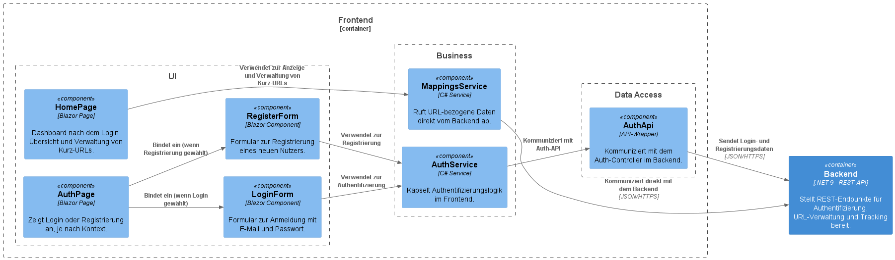

# Dokumentation

Dokumentation zur Projektarbeit im Fach "Software-Qualitätssicherung" an der TH Rosenheim (SoSe25) von Simon Liebers

Der Aufbau dieser Dokumentation orientiert sich am offiziellen [Arc42-Template](https://docs.arc42.org/home/)

## 1. Einführung und Ziele
### Fachliche Anforderungen

Bei der Anwendung handelt es sich um einen URL-Shortener mit Benutzerkonten. Nutzer:innen können sich mit E-Mail-Adresse und Passwort registrieren und anschließend über ein persönliches Dashboard kurze URLs erstellen. Die erstellten Kurz-URLs werden dem jeweiligen Nutzerkonto zugeordnet und können jederzeit wieder gelöscht werden.

Ein zentrales Feature der Anwendung ist das Click Tracking: Wenn eine Person auf eine Kurz-URL klickt, werden Informationen wie IP-Adresse, Gerätetyp, Betriebssystem und Browser (aus dem User-Agent) in der Datenbank gespeichert. Die Nutzerinnen und Nutzer der Anwendung können für jede Kurz-URL eine detaillierte Auflistung dieser Zugriffsdaten einsehen. Zusätzlich wird eine Zählung angezeigt, wie oft eine URL bereits aufgerufen wurde.

### Qualitätsziele
Die Anwendung verfolgt mehrere zentrale Qualitätsziele, die sowohl die Benutzerfreundlichkeit als auch die technische Umsetzung betreffen:

- **Benutzerfreundlichkeit**: Die Registrierung und Nutzung der Anwendung soll möglichst intuitiv und ohne technische Vorkenntnisse möglich sein.
- **Sicherheit**: Der Schutz personenbezogener Daten (z. B. E-Mail-Adressen und Tracking-Informationen) hat hohe Priorität. Die Datenübertragung erfolgt verschlüsselt.
- **Wartbarkeit**: Der Quellcode ist modular aufgebaut, um spätere Erweiterungen zu erleichtern.
- **Performance**: Die Anwendung soll auch bei vielen gleichzeitig geklickten Links zuverlässig und performant reagieren.

### Stakeholder
Die wesentlichen Stakeholder dieses Projekts sind:

- Studierende des Moduls Software-Qualitätssicherung an der TH Rosenheim.
- Lehrende/Dozenten, die das Projekt im Kontext der Lehrveranstaltung begleiten und bewerten.

## 2. Randbedingungen
Im Rahmen des Projekts galten folgende Einschränkungen und Rahmenbedingungen:

- **Architekturvorgabe**: Die Anwendung musste als verteiltes System umgesetzt werden, bestehend aus einem Frontend, einem Backend sowie einer persistenten Datenhaltung (Datenbank).

- **Technologievorgabe**: Es durften ausschließlich folgende Programmiersprachen verwendet werden:
    - Java
    - C#
    - Python
    - TypeScript

- **Externe Abhängigkeiten**: Eine externe API musste im Projekt integriert und genutzt werden.

- **Zeitliche Einschränkung**: Die Umsetzung des Projekts musste bis zur Präsentation am 24. Juni 2025 abgeschlossen sein.

- **Quellcodeverwaltung**: Als zentrales Repository für die Versionsverwaltung muss GitHub verwendet werden.

## 3. Kontextabgrenzung

Das System ist ein Webservice mit direkter Interaktion durch Benutzer über den Browser. Die einzige externe Schnittstelle ist eine Third-Party-API zur Analyse von User-Agent-Strings.

**Externe Beteiligte**:         

- **Endnutzer:innen**: Interagieren über das Web-Frontend mit der Anwendung, z. B. zum Erstellen und Verwalten von Kurz-URLs. Oder klicken auf eine generierte URL, um weitergeleitet zu werden.
- **Externer Dienst – ApicAgent**: Wird vom Backend genutzt, um die im User-Agent enthaltenen Informationen (z. B. Betriebssystem, Gerät, Browser) strukturiert zu analysieren und zu speichern.


## 4. Lösungsstrategie

Für die Umsetzung der Anwendung wurde bewusst ein konsistenter Technologie-Stack auf Basis von .NET gewählt. Diese Entscheidung basiert auf mehreren Vorteilen:

- **Integrierte Entwicklung**: Durch die Verwendung von Blazor Server für das Frontend und ASP.NET Core Web API für das Backend konnte die gesamte Anwendung innerhalb des .NET-Ökosystems entwickelt werden. Dies ermöglichte eine reibungslose Integration, eine einheitliche Sprache (C#) sowie eine effiziente Entwicklung.

- **MSSQL**: MSSQL als relationale Datenbank wurde gewählt, da es eine stabile und leistungsstarke Lösung für datenintensive Webanwendungen darstellt. Die gute Integration mit Entity Framework Core ermöglichte eine komfortable und zugleich flexible Datenzugriffsschicht.

- **Entity Framework**: Entity Framework Core wurde zur Abbildung des Datenmodells und für die Kommunikation mit der Datenbank verwendet. Dank der Code-First-Strategie können Datenbankmigrationen versioniert und automatisiert durchgeführt werden.

- **Schichtmodell**: Die Anwendung folgt einem klassischen Schichtenmodell, bei dem Präsentations-, Geschäftslogik- und Persistenzschicht klar voneinander getrennt sind. Dies erleichtert die Wartung und zukünftige Erweiterungen.

## 5. Baustein-Sicht 
Die Anwendung ist in klar getrennte Projektbereiche unterteilt, die die verschiedenen Aufgaben und Verantwortlichkeiten innerhalb des Systems abbilden. Dabei wurde auf eine modulare und wiederverwendbare Struktur geachtet, die sowohl im Backend als auch im Frontend eine saubere Trennung von Zuständigkeiten ermöglicht.

### Gemeinsame Bausteine

Das Projekt ``UrlShortener.App.Shared`` enthält alle gemeinsam genutzten Modelle und DTOs, die zwischen Frontend und Backend ausgetauscht werden. Die zentrale Ablage dieser Strukturen ermöglicht eine typsichere Kommunikation innerhalb des .NET-Ökosystems.

### Backend Bausteine
Das Backend besteht aus dem Projekt ``UrlShortener.App.Backend`` und ist in mehrere Module unterteilt:

- **Controllers:** Enthält die REST-Endpunkte für Authentifizierung (AuthController), Systemstatus (HealthCheckController), URL-Verwaltung (MappingsController) und Weiterleitung (RedirectController).
- **Business**: Implementiert die Geschäftslogik für Authentifizierung, Erstellung und Löschung von URLs, sowie das Tracking von Klicks inkl. API-Kommunikation mit ApicAgent.
- **Data Access**: Implementiert den Zugriff auf die Datenbank
- **Models**: Enthält die Models, die von der ApicAgent REST-API per HTTP-Request zur Verfügung gestellt werden.
- **Extensions**: Sammlung von statischen Hilfsklassen.
- **Middleware**: Implementierung eigener Middleware, um das Verhalten der Anwendung zentral zu steuern (Zum Beispiel, um ein Delay auf eingehende Requests anzuwenden, um Brute-Force Angriffe auf den Login ineffizient zu machen).

Zentrale Komponenten (Controller, Business Logic, Data Access) werden hier genauer erklärt:


### Frontend-Bausteine

Das Frontend besteht aus zwei Projekten:

- Das Projekt ``UrlShortener.App.Blazor`` stellt die Anwendung bereit und fungiert als Host für die Blazor Server-Komponenten.

- Die eigentlichen UI- und Interaktionslogiken befinden sich im Projekt ``UrlShortener.App.Blazor.Client``, unterteilt in folgende Bausteine:

    - **API**: Wrapper für die Kommunikation mit dem Backend via HTTP.
    - **Business**: Client-seitige Geschäftslogik zur Verwaltung von URLs und Anzeige der Tracking-Daten.
    - **Components**: UI-Komponenten wie Formulare, Tabellen oder Dialoge.
    - **Extensions**: Erweiterungsmethoden und Hilfsfunktionen für die UI oder Datenverarbeitung.

Zentrale Komponenten (Components/UI, Business Logic, Data Access) werden hier genauer erklärt:


## 6. Runtime-Sicht
Die Runtime-Sicht beschreibt typische Abläufe innerhalb des Systems zur Laufzeit. Dabei werden die Interaktionen zwischen Nutzer, Frontend, Backend, Datenbank und externen APIs dargestellt. Im Folgenden werden zwei zentrale Szenarien der Anwendung beispielhaft beschrieben.

### Szenario 1: Nutzer erstellt eine neue Kurz-URL
1. Der angemeldete Nutzer öffnet die HomePage im Blazor-Frontend.
2. Über ein Formular gibt er eine Lange URL und einen Titel ein und klickt auf „Submit“.
3. Das Frontend ruft den REST-Endpunkt /api/mappings/create im MappingsController des Backends per POST-Request mit den eingegeben Daten auf.
4. Das Backend validiert die Eingabe und generiert eine eindeutige Kurz-URL.
4. Die Lange URL, die generierte Kurz-URL, der Timestamp, der Titel und die Benutzer-ID werden in der Datenbank gespeichert.
5. Die neue URL wird dem Benutzer im Frontend angezeigt und zur Übersichtsliste hinzugefügt. Außerdem werden Statistiken angezeigt.


### Szenario 2: Ein Dritter klickt auf eine Kurz-URL
1. Eine Person ruft eine zuvor generierte Kurz-URL im Browser auf.
2. Der Request erreicht den RedirectController, welcher die Kurz-URL durch den Pfad mit der Datenbank abgleicht.
3. Wenn ein Mapping gefunden wird:
    - Das System extrahiert die IP-Adresse und den User-Agent des Clients aus dem Request-Header.
    - Der User-Agent wird über die externe ApicAgent-API per GET-Request analysiert, um Gerät, OS und Browser zu bestimmen.
    - Ein neuer Tracking-Eintrag wird in der Datenbank gespeichert (inkl. Zeitpunkt, IP, Gerätedaten etc.).
    - Der Client wird mit einem HTTP-Redirect (Status 302) zur Lang-URL weitergeleitet.
8. Falls kein Mapping existiert, wird eine 404-Fehlermeldung zurückgegeben.


Beide Szenarien zeigen, wie die verschiedenen Systemkomponenten zusammenarbeiten, um Kernfunktionalitäten wie URL-Erstellung und umzusetzen.

## 7. Verteilungssicht
Die Anwendung wird containerisiert ausgeliefert und über eine zentrale docker-compose-Konfiguration gestartet. Sie besteht aus drei Hauptdiensten – Backend, Frontend und Datenbank – die jeweils in einem eigenen Docker-Container laufen. Images von Frontend und Backend werden automatisch via GitHub Actions gebaut und mit der jeweils aktuellen Version veröffentlicht.


- **Backend-Container**:
    - Beinhaltet die gesamte Geschäftslogik und Datenverarbeitung.
    - Bietet REST-Endpunkte zur Nutzerregistrierung, URL-Verwaltung, Weiterleitung und Tracking.
    - Ruft REST-API von [ApicAgent](https://www.apicagent.com/) auf zur Analyse des UserAgents des Nutzers.

- **Frontend-Container**:
    - Stellt die Benutzeroberfläche bereit.
    - Verantwortlich für Benutzerinteraktion, URL-Verwaltung und Anzeige der Tracking-Daten.
    - Kommuniziert per HTTP-REST mit dem Backend.

- **Datenbank (MS SQL Server)**      
    - Persistiert Benutzerkonten, Kurz-URLs und Tracking-Informationen.
    - Wird ausschließlich vom Backend angesprochen.

### Build & Deployment

- **Buildprozess über GitHub Actions**:
Bei jeder Änderung im Repository wird automatisch ein neuer Build-Workflow ausgelöst. Dabei werden beide Images erzeugt, getaggt und veröffentlicht.

- **Docker-Compose-Konfiguration**:
Alle Dienste werden konsistent über ``docker-compose up`` gestartet. Die Kommunikation zwischen Frontend und Backend erfolgt über ein definiertes Container-Netzwerk.

### Lokale Entwicklung
Für die lokale Ausführung genügt:

```bash
docker-compose up --build
```

## 8. Querschnittskonzepte

### Sicherheit
Die Anwendung verwendet ein tokenbasiertes Authentifizierungssystem auf Basis von JWT (JSON Web Token). Nach erfolgreicher Registrierung oder Anmeldung erhält der Client ein signiertes Token, das bei allen nachfolgenden REST-Requests im HTTP-Header mitgesendet wird.

Durch dieses Verfahren wird sichergestellt, dass nur authentifizierte Nutzer:innen Zugriff auf geschützte Ressourcen (z. B. eigene URLs oder Tracking-Daten) erhalten. Auf Serverseite wird jedes Token geprüft, bevor ein API-Endpunkt verarbeitet wird. Dies gewährleistet eine sichere und skalierbare Zugriffskontrolle ohne die Notwendigkeit einer serverseitigen Session-Verwaltung.

**Zusätzliche Sicherheitsmaßnahmen**:           

- HTTPS-Verschlüsselung zur Absicherung der Kommunikation.
- Validierung von Eingaben zur Vermeidung von Injection-Angriffen.
- CORS-Konfiguration, um nur erlaubte Ursprünge zu akzeptieren.
    - Während der Entwicklung werden zur Vereinfachung alle Ursprünge erlaubt. Im Produktiven Einsatz sollten erlaubte Quellen noch explizit konfiguriert werden, um eine maximale Sicherheit zu gewährleisten.

### User Interface
Die Benutzeroberfläche wurde mit Blazor Server entwickelt und nutzt Tailwind CSS als Styling-Framework. Tailwind ermöglicht ein konsistentes, modernes und responsives Design durch Utility-Klassen direkt im Markup. Das Resultat ist eine klar strukturierte, leicht anpassbare Oberfläche mit einem schlanken und professionellen Look.

Die Anwendung besteht aus modular aufgebauten Komponenten, z. B. für Formulare, Tabellen, Buttons und Dialoge. Diese wurden als wiederverwendbare Blazor-Komponenten organisiert und sorgen für ein einheitliches Look-and-Feel innerhalb der gesamten Anwendung.

### User Experience
Besonderer Wert wurde auf eine intuitive und fokussierte Nutzererfahrung gelegt. Die Oberfläche ist minimalistisch gehalten und lenkt die Aufmerksamkeit auf die Kernfunktionen: URLs kürzen, verwalten und analysieren.

Dank Tailwind CSS konnten UI-Elemente wie Formulareingaben, Fehlermeldungen oder Dialoge benutzerfreundlich gestaltet werden. Die Reaktivität und kurze Ladezeiten durch Blazor Server sorgen für ein flüssiges Nutzererlebnis ohne spürbare Wartezeiten.

**Weitere UX-Merkmale**:

- Eingabevalidierung direkt beim Tippen.
- Modale Dialoge für Trackingdaten, damit der Seitenkontext erhalten bleibt.
- Feedback-Mechanismen nach Nutzeraktionen (z. B. Toast-Meldungen nach erfolgreichem Speichern oder Löschen).

Das gesamte UI/UX-Design zielt darauf ab, die Nutzung der Anwendung auch für technisch weniger erfahrene Anwender:innen so einfach und angenehm wie möglich zu machen.

### Qualitätssichernde Maßnahmen und Tests

Die Qualität der Anwendung wurde durch verschiedene Testarten, automatisierte Analysen und CI sichergestellt. Der Fokus lag dabei sowohl auf funktionaler Korrektheit als auch auf nicht-funktionalen Aspekten wie Performance und Sicherheit.

#### Unittests (Backend)
Im Projekt ``UrlShortener.Test.Backend`` wurden umfassende Unit-Tests für die Kernlogik des Backends erstellt. Dabei wurden u. a. folgende Bereiche abgedeckt:

- Validierung von URL-Eingaben
- Erzeugung und Speicherung von Kurz-URLs
- Authentifizierungs-Logik (z. B. Token-Handling)
- Trennung der Tests nach Modulen (Mapping, Auth, Tracking)

#### Unittests (Frontend)
Im Projekt ``UrlShortener.Test.Frontend`` wurden Unit-Tests für die Frontend-Komponenten durchgeführt. Dabei lag der Fokus auf:

- Validierung von Eingaben in Formularen
- UI-Komponentenverhalten
- Funktionalität der Geschäftslogik

#### Unittests (Shared)
Im Projekt ``UrlShortener.Test.Shared`` wurden Unit-Tests für die geteilten DTO-Klassen und Extension-Methoden durchgeführt.

#### Integrationstests
Das Projekt ``UrlShortener.Test.Backend`` enthält auch Integrationstests, die die REST-API testen. Es wurden u. a. getestet:

- Registrierung und Login
- Erstellen und Löschen von Kurz-URLs
- Zugriffsschutz über JWT
- Rückgabeverhalten bei fehlerhaften Requests

#### Penetration-Tests
Im Projekt ``UrlShortener.Test.End2End`` wurden gezielt Sicherheitstests (PenTests) implementiert, u. a. um zu prüfen:

- Unberechtigter Zugriff auf geschützte Ressourcen
- Manipulation von JWTs
- Eingabe von potenziell schädlichem Code (Injection-Angriffe)
- Verhalten bei abgelaufenen oder ungültigen Tokens

#### End2End-Tests
Ebenfalls in ``UrlShortener.Test.End2End`` befinden sich die End2End-Tests, mit denen komplette Nutzungsflüsse simuliert und geprüft werden. Dazu werden sowohl Backend, Frontend und eine In-Memory-Datenbank gestartet und mittels PlayWright durch das UI navigiert. Diese Tests laufen automatisiert in der CI-Pipeline (Headless) und prüfen:

- Funktionale Korrektheit des Zusammenspiels zwischen Frontend und Backend
- Darstellung und Zustand der UI nach typischen Aktionen
- Rückmeldungen bei Erfolgen und Fehlern

#### Last-Tests
Die Anwendung wurde zudem mit Lasttests auf ihre Stabilität unter erhöhter Benutzeraktivität geprüft. Dabei wurde unter anderem simuliert:

- Massenerstellung von URLs
- Verhalten von Login/Registrierung unter Last
- Rate-Limiting

#### Statische Codeanalyse
Die Anwendung wird mithilfe von SonarQube regelmäßig auf Code Smells, Security Vulnerabilities, Duplikate und Testabdeckung überprüft. Die SonarQube-Auswertungen sind in den CI-Workflow integriert und liefern konkrete Hinweise zur Codequalität.

#### Analyse von Abhängigkeiten

Zusätzlich zu den Penetration-Tests und der statischen Codeanalyse wurde ein automatisierter **OWASP Dependency Check** durchgeführt. Dabei wurden sämtliche verwendeten Bibliotheken auf bekannte Schwachstellen geprüft (CVE-Datenbank).

Der Dependency Check wurde in den CI-Prozess integriert, sodass Sicherheitsrisiken in Drittanbieterpaketen frühzeitig erkannt und adressiert werden können. Ziel ist es, die Angriffsfläche durch unsichere Abhängigkeiten zu minimieren und aktuelle Sicherheitsstandards einzuhalten.

## 9. Architekturentscheidungen
Die wichtigsten Entscheidungen mit Auswirkungen auf die Architektur wurden als Architecture Decision Records (ADR) dokumentiert.

### ADR 1: Entscheidung für eigenen URL-Shortener

**Status**: Entschieden  
**Datum**: 2025-03-18

**Entscheidung**:
Ich habe mich entschieden, den URL-Shortener selbst zu implementieren, anstatt auf einen externen Dienst zurückzugreifen. Alle Kurz-URLs werden in einer eigenen Datenbank gespeichert und können von den Nutzern verwaltet werden.

**Begründung**:

- Volle Kontrolle über die URL-Verwaltung und gespeicherte Daten.
- Möglichkeit zur Integration zusätzlicher Funktionen wie Tracking und Analytics.
- Benutzer können personalisierte Kurzlinks erstellen.
- Flexibilität für zukünftige Erweiterungen.

**Alternativen**:

- Nutzung externer Dienste wie Bitly oder TinyURL.
    - **Vorteile**: Schnellere Implementierung, keine eigene Infrastruktur nötig.
    - **Nachteile**: Eingeschränkte Anpassbarkeit, Abhängigkeit von Dritten, evtl. zusätzliche Kosten.

### ADR 2: Entscheidung für JWT-Authentifizierung

**Status**: Entschieden  
**Datum**: 2025-03-18

**Entscheidung**:
Ich verwende ``JSON Web Tokens (JWT)`` zur Authentifizierung und Autorisierung der Nutzer. Das Token wird im lokalen Speicher des Browsers abgelegt und bei jedem Request an das Backend übermittelt.

**Begründung**:

- JWTs sind leichtgewichtig und effizient.
- Ermöglichen zustandslose Authentifizierung (keine Session-Daten auf dem Server nötig).
- Weit verbreitet, gut dokumentiert und einfach in Blazor und ASP.NET Core integrierbar.
- Tokenbasierte Authentifizierung ist sicher und skalierbar.

**Alternativen**:

- Session-basierte Authentifizierung.
    - **Vorteile**: Einfach umsetzbar für kleine Anwendungen.
    - **Nachteile**: Server benötigt Speicher für Sessions, schlechter skalierbar.

### ADR 3: Entscheidung für SQL Server als Datenbank

**Status**: Entschieden  
**Datum**: 2025-03-19

**Entscheidung**:
Ich verwende **Microsoft SQL Server** als relationale Datenbank für das Backend. Diese Wahl bietet eine zuverlässige Grundlage für Transaktionen und komplexe Abfragen im Zusammenhang mit Benutzer- und URL-Daten.

**Begründung**:

- SQL Server ist stabil, performant und unterstützt ACID-Transaktionen.
- Nahtlose Integration mit Entity Framework Core.
- Persönliche Erfahrung im Umgang mit SQL Server – keine Einarbeitung nötig.

**Alternativen**:

- Nutzung von NoSQL-Datenbanken wie MongoDB.
    - **Vorteile**: Besser für unstrukturierte Daten, horizontale Skalierung möglich.
    - **Nachteile**: Komplexe Abfragen schwieriger, keine konsistenten Transaktionen.

### ADR 4: Entscheidung für Blazor als Frontend-Technologie

**Status**: Entschieden  
**Datum**: 2025-03-19

**Entscheidung**:
Ich habe mich für **Blazor** als Frontend-Framework entschieden, da es die Entwicklung interaktiver Webanwendungen in C# ermöglicht und die Wiederverwendung von Code zwischen Frontend und Backend unterstützt.

**Begründung**:

- C# kann sowohl im Frontend als auch im Backend verwendet werden.
- Gute Integration mit ASP.NET Core.
- Möglichkeit, bestehende .NET-Bibliotheken zu verwenden.
- Kein Wechsel zu JavaScript nötig – reduziert Komplexität.

**Alternativen**:

- Einsatz von React oder Angular.
    - **Vorteile**: Große Community, viele UI-Bibliotheken.
    - **Nachteile**: JavaScript notwendig, keine direkte .NET-Integration.

### ADR 5: Entscheidung für Blazor Server statt Blazor WebAssembly

**Status**: Entschieden  
**Datum**: 2025-03-20

**Entscheidung**:
Ich habe mich für **Blazor Server** als Hosting-Modell entschieden. Die Logik wird vollständig serverseitig ausgeführt, und der Client kommuniziert per SignalR-Verbindung mit dem Server.

**Begründung**:

- Höhere Sicherheit, da keine API-Requests oder Logik im Browser sichtbar sind.
- Schnellere Ladezeiten, da keine WebAssembly-Runtime benötigt wird.

**Alternativen**:

- Blazor WebAssembly
    - **Vorteile**: Vollständig clientseitig, offlinefähig.
    - **Nachteile**: Logik im Browser einsehbar, längere Ladezeit.

## 10. Qualitätsanforderungen

### Nicht-funktionale Qualitätsanforderungen

#### Sicherheit

- Authentifizierung & Autorisierung: Zugriff auf geschützte Bereiche ist nur nach Login mit gültigem JWT-Token möglich.
- Datenverschlüsselung: Die Kommunikation zwischen Client und Server erfolgt über HTTPS.
- Input-Validierung: Sämtliche Benutzereingaben werden serverseitig validiert, um Angriffe wie SQL-Injection zu verhindern.
- Trennung der Rollen: Nicht angemeldete Benutzer haben keinerlei Zugriff auf Nutzerdaten oder Kurz-URLs.

#### Effizienz und Performanz
- Schnelle Antwortzeiten durch serverseitiges Rendering mit Blazor Server.
- Vermeidung von unnötigen Datenbankabfragen.
- Asynchrone Verarbeitung von Tracking-Informationen zur Entkopplung vom Benutzerfluss (Weiterleitung erfolgt sofort, Tracking im Hintergrund).

#### Wartbarkeit

- **Wartbarkeit und Erweiterbarkeit**: Die Anwendung ist in modularen Bausteinen organisiert (nach Schichtenmodell und klarer Trennung von Concerns). Gemeinsame Modelle liegen in einem Shared-Projekt, sodass Änderungen zentral vorgenommen werden können.

- **Wirtschaftlichkeit**: Durch die einheitliche Verwendung von .NET und C# über alle Ebenen hinweg kann Entwicklungs- und Wartungsaufwand minimiert werden. Zudem ist durch Dockerisierung ein einfaches Rollout möglich.

#### Benutzbarkeit

- **Benutzerfreundlichkeit**: Die Oberfläche ist minimalistisch und intuitiv gehalten. Tailwind CSS sorgt für ein einheitliches, modernes Design. Wichtige Funktionen wie das Kürzen und Löschen von URLs oder das Anzeigen von Trackingdaten sind mit wenigen Klicks erreichbar.

#### Kompatibilität

- **Interoperabilität und Integration**: Die Anwendung nutzt standardisierte HTTP-REST-Schnittstellen und kann damit auch problemlos von anderen Systemen angesprochen oder erweitert werden.

- **Funktionale Eignung**: Die Kernfunktionen (Erstellen, Verwalten und Auswerten von Kurz-URLs) sind vollständig implementiert und entsprechen den Anforderungen.

- **Portabilität**:
Die Anwendung läuft containerisiert über Docker und ist damit unabhängig vom Betriebssystem oder der Infrastruktur einfach auf verschiedenen Umgebungen deploybar.

- **Zuverlässigkeit**: Das System erkennt fehlerhafte Eingaben und bietet dem Benutzer entsprechendes Feedback.

## 11. Risiken und Technische Schulden

### Risiken

#### 1. Abhängigkeit von ApicAgent als Drittanbieter

Die Analyse der User-Agent-Daten erfolgt über die kostenlose API von ApicAgent. Diese unterliegt Nutzungseinschränkungen und ist bei intensiver oder kommerzieller Nutzung kostenpflichtig.

- Auswirkungen: Potenzielle Kosten bei Skalierung; Risiko der Dienstabschaltung oder API-Änderungen.
- Empfohlene Maßnahme: Alternative Lösungen, Vertrag mit SLA im echten Betrieb

#### 2. Kein Caching bei häufig verwendeten Kurz-URLs

Jede Weiterleitung einer Kurz-URL löst eine Datenbankabfrage aus, selbst bei sehr häufig genutzten URLs.

- Auswirkungen: Mögliche Performance-Probleme bei hoher Last (Hotspot-Links).
- Empfohlene Maßnahme: Einführung eines In-Memory-Cachings (z. B. Redis) für Kurz-URLs.

#### 3. Fehlendes Rate-Limiting für ApicAgent-Requests

Jeder Klick auf eine Kurz-URL löst direkt einen API-Call aus. Bei hoher Zugriffszahl kann dies zu Blockierungen oder Rate-Limits führen.

- Auswirkungen: Tracking-Funktion kann zeitweise ausfallen.
- Empfohlene Maßnahme: Asynchrone Verarbeitung mit Warteschlange.

### Technische Schulden

#### 1. Fehlender Refresh-Token-Mechanismus bei JWT-Authentifizierung

Aktuell verfällt das JWT nach Ablauf (60 Minuten) ohne Möglichkeit zur Erneuerung. Benutzer:innen müssen sich neu einloggen, was die Usability verschlechtert.

- Auswirkungen: Schlechte Nutzererfahrung, insbesondere bei längerem Arbeiten im Dashboard.
- Empfohlene Maßnahme: Einführung eines Refresh-Token-Workflows, um Tokens serverseitig erneuern zu können.

#### 2. Fehlende Invalidierung des JWT-Tokens nach dem Logout

Aktuell wird die Logout-Funktionalität nur auf der Frontend-Seite behandelt. Der Token wird hier einfach aus dem Browser-Storage gelöscht und die Anwendung refresht. Dadurch wird der Nutzer ausgeloggt. Der Token bleibt jedoch weiterhin valide.

- Auswirkungen: Bad Practice. Nicht mehr verwendete Token, sollten aus Sicherheitsgründen invalidiert werden.
- Empfohlene Maßnahme: Einführung eines Logout-Endpunkts im Auth-Controller, der einen Token invalidiert.

## 12. Glossar

| Begriff     | Erklärung                                                                 |
|-------------------------|----------------------------------------------------------------------------------------|
| **ADR**                 | *Architecture Decision Record* – Dokumentation einer wichtigen Architekturentscheidung |
| **API**                 | *Application Programming Interface* – Schnittstelle zur Kommunikation zwischen Systemen |
| **CI/CD**               | *Continuous Integration / Continuous Deployment* – Automatisierter Build- und Deployment-Prozess |
| **CORS**                | *Cross-Origin Resource Sharing* – Sicherheitsmechanismus im Browser für Webanfragen über Domain-Grenzen hinweg |
| **DTO**                 | *Data Transfer Object* – Objekt zur Übertragung von Daten zwischen Systemkomponenten oder -schichten |
| **EF Core**             | *Entity Framework Core* – Objekt-Relationaler Mapper für .NET zur Datenbankkommunikation |
| **HTTP**                | *Hypertext Transfer Protocol* – Protokoll für die Kommunikation im Web |
| **JWT**                 | *JSON Web Token* – Token zur Authentifizierung und Autorisierung |
| **MS SQL Server**       | Microsofts relationales Datenbankmanagementsystem – verwendet zur persistenten Speicherung |
| **REST**                | *Representational State Transfer* – Architekturstil für webbasierte APIs |
| **UI**                  | *User Interface* – Benutzerschnittstelle / Benutzeroberfläche |
| **UX**                  | *User Experience* – Nutzererlebnis im Umgang mit einer Anwendung |
| **URL**                 | *Uniform Resource Locator* – Eindeutige Adresse zur Identifikation einer Ressource im Web |
| **Blazor**              | Web-Framework von Microsoft zur Entwicklung interaktiver Benutzeroberflächen mit C# |
| **ApicAgent**           | Externer Dienst zur Analyse von User-Agent-Strings zur Geräte-, OS- und Browser-Erkennung |
| **Docker**              | Plattform zur Containerisierung von Anwendungen, um sie konsistent und portabel auszuführen |
| **GitHub Actions**      | CI/CD-System von GitHub zur Automatisierung von Build- und Deploymentprozessen |
| **Playwright**          | Automatisierungsframework zur Durchführung von End-to-End-Tests über UI-Interaktion |
| **OWASP**               | *Open Worldwide Application Security Project* – Projekt zur Verbesserung der Softwaresicherheit |
| **Rate-Limiting**       | Technik zur Begrenzung von Anfragen an eine Schnittstelle, um Missbrauch oder Überlastung zu verhindern |